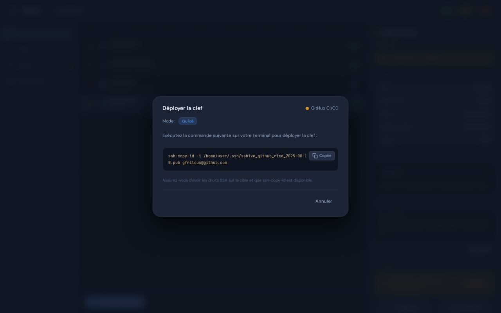

Le **déploiement** est le processus qui pousse votre clef publique vers un service. SSHive supporte trois modes selon le type de service et votre infrastructure.

## Modes de déploiement



*Modal de déploiement : adapte l'interface selon le mode configuré (automatique, guidé ou CM externe).*

### Mode Automatique

SSHive déploie la clef complètement sans intervention.

**Services supportés :**
- GitHub (via l'API `/user/keys`)
- GitLab.com (via l'API `/user/keys`)
- GitLab auto-hébergé (via l'API `/user/keys`)
- SSH générique (via `ssh-copy-id`)

**Flux :**

1. Vous cliquez **Déployer**
2. SSHive envoie la clef publique (GitHub/GitLab) ou exécute `ssh-copy-id` (SSH)
3. Une vérification post-déploiement se connecte au service pour confirmer l'acceptation
4. L'écran affiche **"✓ Connexion vérifiée"** ou **"⚠ Vérification non effectuée"**

**Prérequis :**
- Token API valide (GitHub/GitLab)
- Accès SSH fonctionnel (SSH générique)
- Aucune clef existante avec le même fingerprint (GitHub/GitLab détectent les doublons)

### Mode Guidé

Vous copier-collez une commande fournie par SSHive.

**Utile quand :**
- Vous travaillez sur un bastion ou derrière un NAT
- L'API du service est inaccessible
- Vous préférez un contrôle manuel
- L'authentification SSH-key est déjà active (mode Automatique ne peut pas s'authentifier)

**Flux :**

1. Vous cliquez **Déployer**
2. SSHive affiche une commande `ssh-copy-id` formatée avec la clef publique
3. Vous la copiez (`"Copier la commande"`)
4. Vous la collez dans un terminal avec accès au serveur
5. La clef est ajoutée à `~/.ssh/authorized_keys`
6. Aucune vérification post-déploiement n'est effectuée (mode semi-automatique)

**Exemple de commande générée :**

```bash
echo 'ssh-ed25519 AAAAC3NzaC1lZDI1NTE5AAAAIAb... user@host' \
  | ssh deploy@server.example.com "cat >> ~/.ssh/authorized_keys"
```

### Mode Géré Externalement (External CM)

Votre infrastructure (NixOS, Ansible, Terraform, etc.) gère les `authorized_keys`.

**Utile quand :**
- Vous déployez avec NixOS, Ansible, Puppet, etc.
- Les clefs sont gérées déclarativement dans du code
- Vous ne voulez pas que SSHive touche directement aux fichiers
- Vous avez une gestion centralisée des accès

**Flux :**

1. Vous créez un service avec le type **SSH générique** et mode **Géré externalement**
2. Vous cliquez **Déployer**
3. SSHive affiche la clef publique complète dans un bloc monospace avec instructions
4. Vous copiez la clef publique
5. Vous l'ajoutez à votre configuration Ansible/NixOS/Terraform/etc.
6. Vous déployez votre infrastructure normalement

**Exemple pour NixOS :**

```nix
users.users.deploy = {
  openssh.authorizedKeys.keys = [
    "ssh-ed25519 AAAAC3NzaC1lZDI1NTE5AAAAIAb... sshive"
  ];
};
```

**Exemple pour Ansible :**

```yaml
- name: Add deployment key
  authorized_key:
    user: deploy
    key: "ssh-ed25519 AAAAC3NzaC1lZDI1NTE5AAAAIAb... sshive"
    state: present
```

## Sélectionner le mode au création

Lors de la création d'un service, à l'**Étape 2** (Déploiement), vous choisissez :

- **Automatique** — SSHive gère tout
- **Guidé** — vous fournissez la commande
- **Géré externalement** — vous intégrez dans votre CM (SSH générique seulement)

## Vérification post-déploiement

Après un déploiement automatique ou guidé, SSHive peut vérifier que la clef fonctionne :

1. Pour GitHub/GitLab : appel API `GET /user` pour confirmer le token fonctionne
2. Pour SSH générique : tentative de connexion SSH sans exécuter aucune commande
3. Pour SK-Ed25519 : vérification obligatoire (le YubiKey doit être présent)

**Résultat :**
- **✓ Connexion vérifiée** — la clef est acceptée et fonctionne
- **⚠ Vérification non effectuée** — déploiement guidé, pas de vérification
- **✗ Erreur de vérification** — la clef n'a pas pu se connecter (voir logs)

## Révoquer une clef déployée

Pour enlever une clef d'un service :

1. Sélectionnez le service
2. Dans la section **Clefs SSH**, trouvez la clef
3. Cliquez **Révoquer**

SSHive :
- Appelle l'API GitHub/GitLab pour supprimer la clef (si applicable)
- Enlève l'entrée de `~/.ssh/authorized_keys` sur le serveur SSH (via `ssh-copy-id` inversé ou `ssh` + `sed`)
- Pour les CM externes, vous devez revenir à votre configuration et relancer le déploiement

## Historique de déploiements

Chaque service liste tous ses déploiements passés :

```
DÉPLOIEMENTS
2026-05-11 14:35:22 — Déploiement automatique via GitHub API (✓ vérifié)
2026-05-11 10:22:10 — Déploiement guidé (⚠ non vérifié)
2026-05-10 09:15:33 — Révocation (suppression de la clef)
```

Consultez cette liste pour tracer les accès et les rotations.

## Dépannage

### Déploiement automatique échoue avec erreur d'API

- **GitHub** : vérifiez le token et le scope `admin:public_key`
- **GitLab** : vérifiez le token, le scope `api`, et l'URL de base
- **SSH générique** : vérifiez la connectivité SSH (hostname, username, port, clefs d'accès)

### Vérification échoue après déploiement

- **Possible cause** : clef bien déployée mais firewall/config SSH bloque la vérification
- **Solution** : vérifiez manuellement que la clef fonctionne : `ssh -i ~/.ssh/id_sshive_github user@host`

### "Clef existe déjà" (GitHub/GitLab)

SSHive détecte les clefs en doublon et affiche **ApiKeyAlreadyPresent**. Cela signifie que la clef a déjà été déployée.

- **Solution** : révoque l'ancienne clef d'abord, puis redéploie

### Mode Guidé : commande ne fonctionne pas

- Vérifiez que vous l'exécutez avec un accès SSH valide (passphrase de clef SSHive existante, etc.)
- Vérifiez les permissons : `~/.ssh/authorized_keys` doit être `0600`

## Bonnes pratiques

**Déploiement automatique par défaut** — c'est le plus sûr et le plus rapide si l'API est accessible.

**Mode guidé pour déboguer** — si l'automatique échoue, passez en mode guidé pour voir exactement quelle commande est exécutée.

**Vérification post-déploiement** — toujours vérifier que la clef fonctionne (SSHive le fait, ou vérifiez manuellement).

**CM externe pour la prod** — si vous avez une infrastructure as code (NixOS, Ansible), utilisez le mode Géré externalement pour traçabilité complète.

**Révoque avant de renouveler** — quand vous générez une nouvelle clef, révoque l'ancienne d'abord pour éviter les doublons.

---

Voir aussi :
- [Services](/guide/services/) — créer et éditer les services
- [Clefs SSH](/guide/keys/) — générer et gérer les clefs
- [Santé](/guide/health/) — vérifier l'état du déploiement
