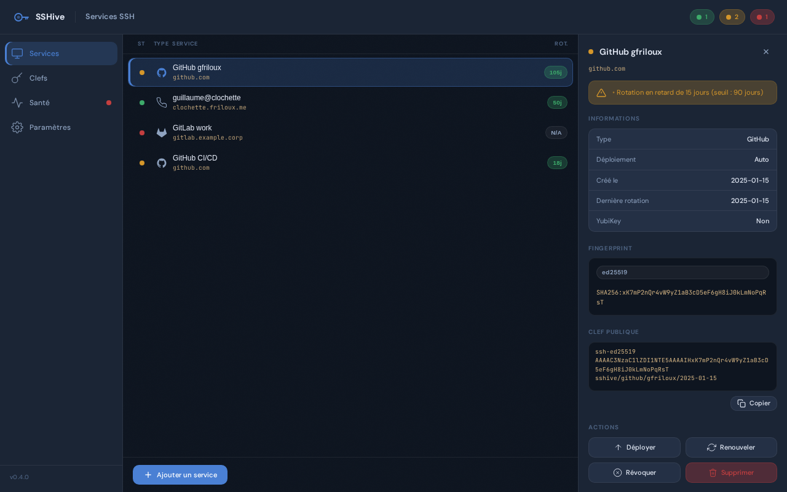

Un **service** dans SSHive représente une destination SSH (GitHub, GitLab, un serveur) et l'une de vos clefs SSH qui y est déployée.

## Types de services

SSHive supporte 4 types de services, chacun avec ses propres caractéristiques :

### GitHub

Autorise la gestion des clefs via l'API GitHub.

**Configuration requise :**
- **Hostname** : `github.com` (auto-rempli)
- **Token API** : `admin:public_key` scope
- **Mode de déploiement** : Automatique (via API) ou Guidé

**Avantages :**
- Déploiement automatique via API
- Vérification post-déploiement (SSH)
- Révocation simplifiée

### GitLab.com

Autorise la gestion des clefs via l'API GitLab public.

**Configuration requise :**
- **Hostname** : `gitlab.com` (auto-rempli)
- **Token API** : `api` scope
- **Mode de déploiement** : Automatique (via API) ou Guidé

**Avantages :**
- Déploiement automatique via API
- Vérification post-déploiement (SSH)
- Révocation simplifiée

### GitLab auto-hébergé

Autorise la gestion des clefs pour une instance GitLab privée.

**Configuration requise :**
- **Hostname** : URL de base de votre instance GitLab (ex : `https://gitlab.example.com`)
- **Token API** : `api` scope
- **Mode de déploiement** : Automatique (via API) ou Guidé

**Avantages :**
- Même API que GitLab.com, mais sur votre serveur
- Déploiement automatique si l'API est accessible
- Sinon, basculez en mode Guidé

### SSH générique

Pour tout serveur SSH standard (Linux, BSD, vos machines…).

**Configuration requise :**
- **Hostname** : adresse IP ou nom de domaine
- **Username** : utilisateur SSH (ex : `deploy`, `ec2-user`)
- **Port** : port SSH (défaut 22)
- **Mode de déploiement** : Automatique (`ssh-copy-id`), Guidé (copier la clef), ou Géré externalement

**Avantages :**
- Flexible pour tout serveur SSH
- Déploiement manuel ou automatique
- Support des CM externes (NixOS, Ansible)

*Panneau de détail d'un service : health banner, fingerprint en amber, historique des déploiements et actions disponibles.*

## Créer un service

1. Cliquez **"Ajouter un service"** dans la liste vide, ou le bouton **+** de la barre latérale
2. **Étape 1 : Type de service**
   - Sélectionnez le type : GitHub, GitLab, GitLab self-hosted ou SSH générique
3. **Étape 2 : Paramètres**
   - Entrez un **nom unique** pour le service
   - SSH générique : remplissez **hostname**, **utilisateur SSH**, **port** (défaut 22)
   - GitLab self-hosted : remplissez l'**URL de l'instance**
   - GitHub/GitLab : saisissez le **token API** (optionnel — configurable plus tard)
4. **Étape 3 : Mode de déploiement**
   - Sélectionnez Automatique, Guidé ou CM externe
   - Vérifiez le récapitulatif puis cliquez **Créer le service**

Le service est créé **sans clef SSH attachée**. L'étape suivante consiste à lui associer une clef.

## Associer une clef SSH à un service

Deux chemins sont disponibles depuis le **panneau de détail** du service (cliquez sur le service dans la liste) :

### Générer une nouvelle clef

Cliquez **"Générer une clef"** dans la page **Clefs** en sélectionnant le service cible. Cela crée une paire ed25519 (ou sk-ed25519 pour YubiKey), chiffrée par passphrase, et l'attache immédiatement au service.

### Attacher une clef existante

Si vous avez déjà une clef gérée par SSHive (visible dans la page **Clefs**) non encore associée à un service :

1. Sélectionnez le service dans la liste — le panneau de détail s'ouvre
2. Dans la section **Clef SSH**, cliquez **"Attacher une clef existante"**
3. Une liste affiche les clefs disponibles avec leur fingerprint et date de création
4. Cliquez sur la clef souhaitée — elle est immédiatement liée au service

:::note
Seules les clefs **gérées** (avec clef privée dans `~/.ssh/`) peuvent être attachées depuis ce sélecteur. Les clefs découvertes par scan sans clef privée ne sont pas proposées.
:::

## Éditer un service

1. Sélectionnez le service dans la liste
2. Cliquez **Éditer** en haut du détail
3. Modifiez les champs souhaités (hostname, username, token API, etc.)
4. Les changements sont sauvegardés automatiquement au clic **Valider**

**Important** : l'édition conserve la clef attachée, l'historique de déploiements et les rotations. Seuls les champs du formulaire sont modifiés.

## Supprimer un service

1. Sélectionnez le service
2. Cliquez **Supprimer** en haut du détail
3. Confirmez la suppression

**Note** : la clef SSH n'est pas supprimée, seulement le service. La clef reste disponible pour d'autres services.

## États et santé

Chaque service affiche une **pastille de santé** (point coloré) indiquant son état :

- **✓ ok (vert)** — clef déployée, non protégée, token API valide (si applicable)
- **ⓘ info (bleu)** — clef présente mais non protégée par passphrase
- **⚠ warning (orange)** — clef manquante, token absent, rotation recommandée
- **✗ critical (rouge)** — clef manquante + rotation dépassée, ou perte de token API

Consultez la page [Santé et diagnostics](/guide/health/) pour la liste complète des raisons.

## Déployer une clef

Une fois le service créé, vous devez **déployer** la clef :

1. Sélectionnez le service
2. Cliquez **Déployer** dans le panneau de détail
3. SSHive exécute le déploiement selon le mode choisi :
   - **Automatique** — API GitHub/GitLab ou `ssh-copy-id`
   - **Guidé** — copie la commande, vous la collez dans le terminal
   - **Géré externalement** — affiche la clef publique à mettre dans votre CM

4. Une vérification post-déploiement confirme que la clef est acceptée
5. Vous verrez **"✓ Connexion vérifiée"** si tout est OK

## Voir l'historique de déploiements

Dans le panneau de détail, la section **DÉPLOIEMENTS** liste tous les déploiements et révocations passés avec timestamps.

## Révoquer une clef

1. Sélectionnez le service
2. Cherchez la clef dans la section **Clefs SSH** du détail
3. Cliquez **Révoquer**

Pour GitHub/GitLab, cela appelle l'API pour supprimer la clef. Pour SSH générique, cela l'enlève de `~/.ssh/authorized_keys` sur le serveur.

## Déployer une clef existante

Si vous avez une clef SSHive non déployée sur un service :

1. Sélectionnez le service
2. Cherchez la clef dans la section **Clefs SSH disponibles**
3. Cliquez **Sélectionner** pour l'attacher
4. Cliquez **Déployer** pour commencer le déploiement

## Astuces et bonnes pratiques

**Une clef par service** — toujours préférer générer une nouvelle clef pour chaque service plutôt que de réutiliser la même clef partout.

**Noms explicites** — utilisez des noms de service clairs comme `GitHub Production` plutôt que `srv1`.

**Documentation locale** — notez le purpose de chaque service (ex : "Déploiements CI/CD" vs "Access personnel").

**Rotation régulière** — configurez un délai d'alerte de rotation (par défaut 90 jours) et examinez la page Santé régulièrement.

---

Voir aussi :
- [Clefs SSH](/guide/keys/) — gestion des clefs
- [Déploiement](/guide/deployment/) — modes de déploiement détaillés
- [Santé](/guide/health/) — diagnostics et alertes
