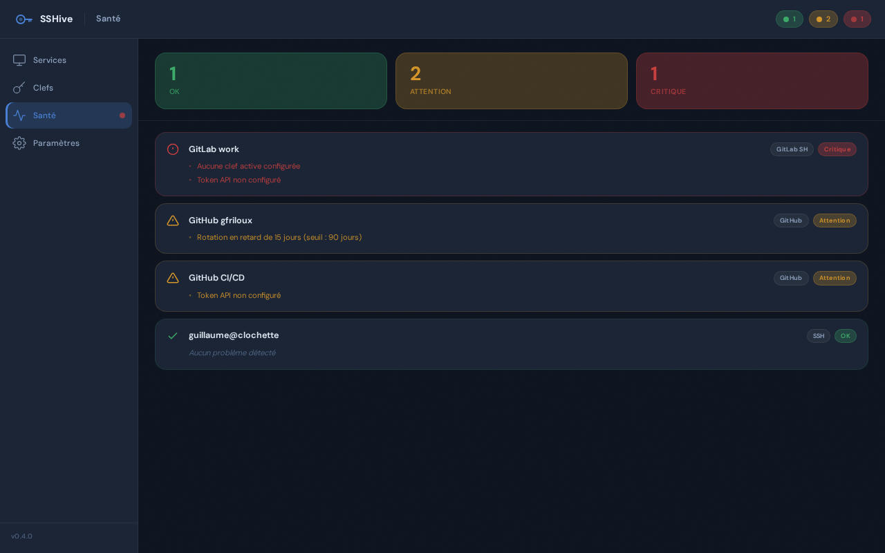

The **Health page** (accessible from the sidebar) displays a complete diagnostic view of all your services and keys, as well as security alerts.

## Health Levels

Each service and key receives a **health level** indicated by a badge and label:

### ✓ ok (green)

Everything is in order.

**Criteria:**
- SSH key attached to service
- Key protected by passphrase
- If GitHub/GitLab: API token valid (recently verified)
- Key deployed successfully
- No rotation overdue

### ⓘ info (blue)

Situation to note, no urgency.

**Common reasons:**
- `HardwareKeyHandleNotBackedUp` — SK key (YubiKey) whose `.pub` file hasn't been backed up
- Key over 30 days old without rotation
- Deployment in progress

**Suggested action:** back up the key file or plan a rotation.

### ⚠ warning (orange)

Situation to correct soon.

**Common reasons:**
- `NoKey` — no key assigned to the service
- `NoApiToken` — GitHub/GitLab service without API token (manual deployment only)
- `KeyUnprotected` — existing SSH key without passphrase
- `RotationRecommended` — key reaches alert threshold (default 90 days)

**Suggested action:** generate a key, add an API token, or protect the existing key.

### ✗ critical (red)

Immediate security issue.

**Common reasons:**
- `NoKey` + `RotationOverdue` — service without key AND current key too old
- `NoApiToken` + `RotationOverdue` — GitHub/GitLab service without token AND key too old

**Suggested action:** immediately generate and deploy a new key.

## Detailed Health Reasons

### Service: No key assigned

```
NoKey
```

**Meaning:** the service has no SSH key attached.

**Possible causes:**
- Service just created, key not yet generated
- Previous key deleted
- Error during service creation

**Fix:**
1. Go to the service detail
2. Click **Generate a new key** or **Select an existing key**
3. Deploy the key

### Service: Key not protected

```
KeyUnprotected
```

**Meaning:** the SSH key has no passphrase.

**Risk:** if someone accesses `~/.ssh/`, they can use the key without entering a passphrase.

**Fix:**
1. Go to the key detail
2. Click **Add a passphrase**
3. Enter a passphrase (≥ 12 characters)

### Rotation Overdue

```
RotationOverdue (85 days)
```

**Meaning:** the key hasn't been renewed in a long time.

**Possible causes:**
- Key created more than X days ago (default 90 days)
- No planned rotation
- Threshold configuration too restrictive

**Fix:**
1. Go to the service detail
2. Click **Renew SSH key**
3. Confirm the rotation
4. The new key is generated and deployed
5. The old key is archived

You can adjust the alert threshold in **Settings** → **Security** → **Rotation warning threshold**.

### No API Token

```
NoApiToken
```

**Meaning:** the service is GitHub/GitLab but no API token is configured.

**Impact:**
- Deployment in manual mode only
- No post-deployment verification
- No automatic revocation

**Fix:**
1. Go to the service detail
2. Click **Edit**
3. At step 2, click **Configure token**
4. Enter the valid API token
5. Validate

### YubiKey File to Back Up

```
HardwareKeyHandleNotBackedUp
```

**Meaning:** SK key (YubiKey) you haven't confirmed backing up the file.

**Risk:** if the YubiKey is lost or destroyed, you can't recover the key.

**Fix:**
1. Go to the SK key detail
2. Note the path to the private key file (ex: `~/.ssh/id_sshive_github_sk`)
3. Click **Understood — I've backed up**
4. The alert disappears

## Diagnostic View



*Diagnostic view: services are grouped by criticality level, most urgent problems at the top of the list.*

The **Health** page displays a table with:

| Column | Meaning |
|--------|---------|
| Service | Service name |
| Type | GitHub, GitLab, SSH, etc. |
| Health | Badge + level (ok/info/warning/critical) |
| Key | Fingerprint of attached key (or "—") |
| Age | Days since generation (ex: "45 days") |
| Protection | ✓ passphrase / ⚠ no passphrase |
| API Token | ✓ valid / ⚠ absent / ✗ invalid (GitHub/GitLab only) |
| Deployment | ✓ ok / ⚠ pending / ✗ error |

Click on a row to see the full service detail and available actions.

## Real-time Alerts

### Critical Health Alert

If one of your services reaches **critical**, a **pulsing red badge** appears in the sidebar next to **Health**. This warns you immediately.

The alert disappears when all services are ok/info/warning.

## Configure Thresholds

Go to **Settings** → **Security** to adjust:

- **Rotation warning threshold** (default 90 days) — number of days before a key becomes warning
- **Minimum passphrase length** (default 12 characters) — minimum required passphrase length

## Complete Audit

Check the audit log to see all actions:

```bash
cat ~/.config/sshive/audit.log
```

Example:

```
2026-05-11T14:35:22Z [sshive] Generated SSH key ed25519 for service GitHub
2026-05-11T14:35:45Z [sshive] Deployed key to GitHub via API (verified: true)
2026-05-11T16:20:10Z [sshive] Rotated key for service Production
2026-05-12T09:10:33Z [sshive] Revoked key from GitLab
```

## Best Practices

**Check Health regularly** — each week, review the Health page to spot alerts.

**Act on warnings** — a warning means you need to take action in the next few days.

**Planned rotations** — don't wait for the threshold; renew keys every 60-90 days for better security.

**Strong passphrases** — always >= 12 characters, ideally 16+ (passphrases recommended).

**YubiKey backup** — after generating an SK-Ed25519, mark as backed up immediately to avoid false positives.

**Zero critical in production** — if there's a critical service, it's blocking; implement a rotation to resolve it.

---

See also:
- [Services](/guide/services/) — create and manage services
- [SSH Keys](/guide/keys/) — generate and renew keys
- [API Tokens](/guide/tokens/) — configure GitHub/GitLab tokens
